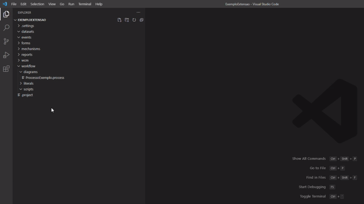
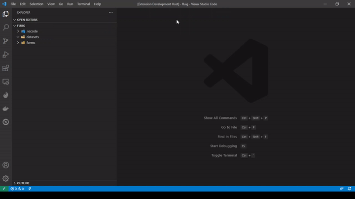
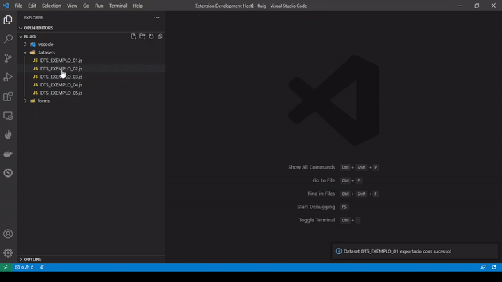

# Fluig - Extensão VS Code

Extensão para facilitar o desenvolvimento na plataforma TOTVS Fluig utilizando o VS Code.

Essa extensão adiciona alguns comandos para criar arquivos e snippets HTML e JavaScript, além de gerenciar seus
Servidores Fluig e permitir Importar e Exportar Datasets.

Os comandos aparecem ao clicar com o botão direito do mouse nos arquivos e diretórios ou pressionando
F1 (Command Palette), sendo obrigatório ter um Diretório / Workspace aberto.

## Instalação

Você pode procurar pela extensão `Fluig - Extensão VS Code` no VS Code, baixá-la diretamente no [VS Code Market Place: Fluig - Extensão VS Code](https://marketplace.visualstudio.com/items?itemName=BrunoGasparetto.fluig-vscode-extension) ou abrir o **Quick Open** (CTRL + P) e executar o comando `ext install brunogasparetto.fluig-vscode-extension`.

Essa extensão cria os arquivos utilizando os tipos declarados na biblioteca [Declaração de Tipos para o Fluig](https://github.com/brunogasparetto/fluig-declaration-type) para ter auto-complete no VS Code, por isso é recomendado que ela seja instalada.

## Como utilizar

Para utilizar os comandos de criação de arquivos é obrigatório estar com um diretório / workspace aberto.

Os seguintes comandos estão disponíveis:

- [Novo Dataset](#novo-dataset);
- [Novo Formulário](#novo-formulário);
- [Novo Evento Global](#novo-evento-global);
- [Novo Evento de Formulário](#novo-evento-de-formulário);
- [Novo Evento de Processo](#novo-evento-de-processo);
- [Importar Dataset e Importar Vários Datasets](#importar-dataset);
- [Exportar Dataset](#exportar-dataset);

Foram criados snippets para as seguintes linguagens:

- [Snippets para HTML](#snippets-para-html);
- [Snippets para JavaScript](#snippets-para-javascript);

## Novo Dataset.

Esse comando cria um arquivo JavaScript, após você preencher o nome do Dataset, no diretório `datasets` do seu projeto Fluig.

O arquivo vem com as quatro funções básicas de datasets que o Fluig disponibiliza.

Você pode executar esse comando no **Command Palette** ou com o menu de contexto no **File Explorer**.

## Novo Formulário.

Esse comando cria, após preencher o nome, um diretório contendo um arquivo HTML de formulário.
Esse diretório é criado dentro do diretório `forms` do seu projeto Fluig.

O arquivo HTML vem com o esqueleto básico de um formulário Fluig utilizando o **Fluig Style Guide**.

Você pode executar esse comando no **Command Palette** ou com o menu de contexto no **File Explorer**.

## Novo Evento Global

Esse comando cria um arquivo JavaScript, após selecionar o evento, no diretório `events` do seu projeto Fluig.

O arquivo JavaScript contém a estrutura da função do evento selecionado.

Você pode executar esse comando no **Command Palette** ou com o menu de contexto no **File Explorer**.

Eventos disponibilizados:

- displayCentralTasks
- onNotify

## Novo Evento de Formulário

Esse comando cria um arquivo JavaScript, após selecionar o evento, no diretório `events` do formulário selecionado.

Esse comando só é exibido no menu de contexto no **File Explorer** ao selecionar um **Formulário** ou qualquer arquivo / diretório que esteja dentro de um formulário.

O arquivo JavaScript contém a estrutura da função do evento selecionado.

Eventos disponibilizados:

- afterProcessing
- afterSaveNew
- beforeProcessing
- displayFields
- enableFields
- inputFields
- setEnable
- validateForm

## Novo Evento de Processo

Esse comando cria um arquivo JavaScript, após selecionar o evento, no diretório `workflow/scripts` do seu projeto Fluig.

Esse comando só é exibido no menu de contexto no **File Explorer** ao selecionar um **Diagrama**, que são arquivos com
a extensão **.process** e estão no diretório `workflow/diagrams`.

O arquivo JavaScript será nomeado seguindo a regra do Fluig (nome_do_diagrama.nome_do_evento.js) e contém a
estrutura da função do evento selecionado.

É possível criar uma função compartilhada para o processo selecionando a opção **Nova Função** no menu de eventos.
Quando o fizer será solicitado que informe o nome da função.

Eventos disponibilizados:

- afterCancelProcess
- afterProcessCreate
- afterProcessFinish
- afterReleaseProcessVersion
- afterReleaseVersion
- afterStateEntry
- afterStateLeave
- afterTaskComplete
- afterTaskCreate
- afterTaskSave
- beforeCancelProcess
- beforeSendData
- beforeStateEntry
- beforeStateLeave
- beforeTaskComplete
- beforeTaskCreate
- beforeTaskSave
- checkComplementsPermission
- subProcessCreated
- validateAvailableStates

## Importar Dataset

Para importar Dataset (ou vários) é necessário ativar clicar com o botão direito do mouse na pasta **Datasets** (ou
em qualquer subitem dela), ou usar o **Command Pallete** (pressionando F1) e então selecionar um dos comandos de
exportação (`Fluig: Importar Dataset` ou `Fluig: Importar Vários Datasets`).

Após selecionar o servidor é exibido a lista de Datasets do servidor para selecionar qual/quais serão importados.

## Exportar Dataset

Para exportar Dataset clique com o botão direito do mouse sobre o Dataset e selecione `Exportar Dataset`.

Após selecionar o servidor você poderá escolher um Dataset para ser editado ou selecionar **Novo Dataset**
para criar o Dataset.

## Snippets para HTML

Snippets para criar estruturas HTML seguindo o **Fluig Style Guide**.

Os snippets disponibilizados são:

- **fluig-alert**: Cria um alerta;
- **fluig-alert-dismissible**: Cria um alerta que pode ser fechado;
- **fluig-button-dropdown-split**: Cria um botão com sub menu;
- **fluig-checkbox-inline**: Cria um input customizado inline do tipo checkbox;
- **fluig-checkbox**: Cria um input customizado do tipo checkbox;
- **fluig-input-data**: cria uma coluna com input do tipo texto e ícone de calendário;
- **fluig-input-text**: cria uma coluna contendo um input do tipo texto;
- **fluig-input-textarea**: cria uma coluna contendo um textarea;
- **fluig-input-zoom**: cria uma coluna contendo um Zoom;
- **fluig-panel-collapse**: cria um painel com estrutura de collapse;
- **fluig-panel**: cria um painel;
- **fluig-radio-inline**: Cria um input customizado inline do tipo radio;
- **fluig-radio**: Cria um input customizado do tipo radio;
- **fluig-switch-aprovacao**: cria uma linha contendo dois botões para indicar aprovação / reprovação;
- **fluig-tabs**: Cria uma navegação em Abas;

## Snippets para JavaScript

Devido ao Fluig utilizar JavaScript para front-end (navegador) e JavaScript para back-end que será convertido em Java
(e possui um suporte antigo) na descrição de cada snippet é indicado se ele deve ser utilizado em qual dos dois
ambientes.

### Snippets para Back-End

- **fluig-function-data**: cria uma função que retorna a data atual formatada no padrão solicitado;
- **fluig-paifilho-loop**: cria um loop for percorrendo os elementos de uma tabela pai filho;

### Snippets para Front-End

- **fluig-beforeMovementOptions**: Evento beforeMovementOptions do formulário no Processo;
- **fluig-beforeSendValidate**: Evento beforeSendValidate do formulário no Processo;
- **fluig-calendar**: Ativa o plugin de Data em um input text;
- **fluig-data-atual**: Pega a data atual formatada em PT-BR;
- **fluig-zoom-removed**: Função executada ao desmarcar item no Zoom;
- **fluig-zoom-selected**: Função executada ao selecionar item no Zoom;

## Todo

- Criar comando Novo Widget;
- Criar comando Novo Layout;
- Adicionar todos os templates de Eventos Globais;
- Adicionar novos Snippets;
- Adicionar importação / exportação de Datasets;

## Colaboração

Sinta-se à vontade para colaborar criando mais snippets, templates de arquivos e comandos.

Basta criar um fork e efetuar uma PR quando estiver pronto.
