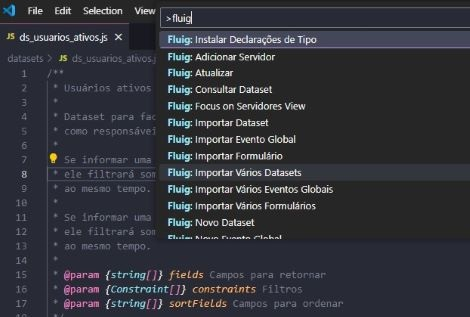
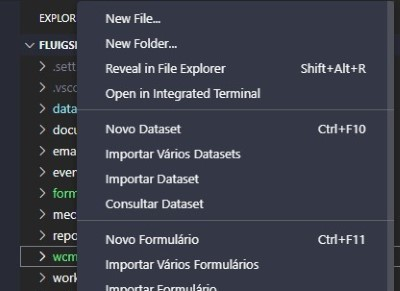

# Fluig - Extensão para Desenvolvimento no VSCode

Extensão para facilitar o desenvolvimento na plataforma TOTVS Fluig utilizando o VSCode.

 

## Aviso

__Essa extensão não é mantida pela TOTVS e não possuí suporte da TOTVS.__

A extensão __Fluig - Extensão para Desenvolvimento no VSCode__ foi desenvolvida pela comunidade de desenvolvedores para Fluig.

O ambiente oficial para desenvolvimento no Fluig continua sendo o Eclipse Luna, conforme documentação oficial do Fluig.

## Instalação

Você pode procurar pela extensão `Fluig - Extensão para Desenvolvimento` no VSCode, baixá-la diretamente no [VS
Code Market Place: Fluig - Extensão para Desenvolvimento](https://marketplace.visualstudio.com/items?itemName=Fluiggers.fluiggers-fluig-vscode-extension) ou abrir o __Quick Open__ (CTRL + P) e executar o
comando `ext install fluiggers.fluiggers-fluig-vscode-extension`.

### Erro de Linguagem não reconhecida

Os snippets para a linguagem FreeMarker (extensão ftl e utilizada nos templates) pode gerar erro de
linguagem não reconhecida caso o VSCode não tenha extensão para tratar a FreeMarker.

## Auto-Completar

Essa extensão cria os arquivos utilizando os tipos declarados na biblioteca [Declaração de Tipos
para o Fluig](https://github.com/fluiggers/fluig-declaration-type) para ter auto-complete no
VSCode, por isso é recomendado que ela seja instalada.

Você pode instalar a __Declaração de Tipos para o Fluig__ baixando o último release disponibilizado no GitHub ou
pode executar o comando `Fluig: Instalar Declarações de Tipo`, no __Command Palette__ (normalmente com a tecla de atalho F1),
para que a Extensão baixe os arquivos para o seu workspace / diretório.

## Como utilizar

Você deve abrir a pasta do seu projeto Fluig, já criado pelo Eclipse.

Caso não abra uma pasta a extensão não será inicializada, gerando erros de comando não encontrado.

### ATENÇÃO

__É importante que você abra somente um projeto por vez.__

O comportamento padrão do VSCode é trabalhar com um projeto por vez. Para se trabalhar com múltiplos projetos
é necessário instalar extensões. Por isso essa extensão para Fluig foi desenvolvida pensando em um projeto
por vez.

### Funcionalidades da Extensão

Após abrir a pasta do projeto Fluig as seguintes funcionalidades serão disponibilizadas:

- [Gerenciar Servidores](#gerenciar-servidores)
- [Consultar Dataset](#consultar-dataset)
- [Novo Dataset](#novo-dataset)
- [Novo Formulário](#novo-formulário)
- [Novo Evento Global](#novo-evento-global)
- [Novo Evento de Formulário](#novo-evento-de-formulário)
- [Novo Evento de Processo](#novo-evento-de-processo)
- [Novo Mecanismo Customizado](#novo-mecanismo-customizado)
- [Novo Widget](#novo-widget)
- [Importar Dataset e Importar Vários Datasets](#importar-dataset)
- [Exportar Dataset](#exportar-dataset)
- [Importar Formulário e Importar Vários Formulários](#importar-formulário)
- [Exportar Formulário](#exportar-formulário)
- [Importar Evento Global e Importar Vários Eventos Globais](#importar-evento-global)
- [Exportar Evento Global](#exportar-evento-global)
- [Excluir Evento Global](#excluir-evento-global)
- [Importar Mecanismo de Atribuição Customizado](#importar-mecanismo-de-atribuição-customizado)
- [Exportar Mecanismo de Atribuição Customizado](#exportar-mecanismo-de-atribuição-customizado)
- [Snippets para HTML](#snippets-para-html)
- [Snippets para JavaScript](#snippets-para-javascript)

## Gerenciar Servidores

Com a extensão instalada será adicionada a visão de gerenciamento de servidores. Nela é possível
adicionar, editar e remover servidores Fluig.

A senha é criptografada utilizando identificadores do computador como chave da criptografia, assim não é possível
decifrar a senha em outro computador, prevenindo a perda de credenciais.

Ao clicar em um servidor é possível visualizar alguns comandos disponíveis. Com eles podemos consultar dataset, serviços etc.

### Consultar Dataset

Ao clicar no servidor será disponibilizada a opção Dataset. Nela você pode consultar um dataset do servidor.

A consulta de Dataset permite configurar as Constraints, selecionar os campos a serem exibidos e também a ordenação.

Diferente do plugin do Eclipse a Consulta de Dataset permite informar uma Constraint que não seja um campo do Dataset,
sendo útil para consulta de Pai Filho ou de Datasets que aceitam Constraints que não são campos retornados.

Diferente do Plugin do Eclipse é possível efetuar várias consultas aos Datasets, cada consulta em sua aba.

## Novo Dataset

Esse comando cria um arquivo JavaScript, após você preencher o nome do Dataset, no diretório
`datasets` do seu projeto Fluig.

O arquivo vem com as quatro funções básicas de datasets que o Fluig disponibiliza.

Você pode executar esse comando no __Command Palette__, no menu de contexto no __File Explorer__ ou pelo
atalho __CTRL + F10__ (CMD + F10 no Mac).

## Novo Formulário

Esse comando cria, após preencher o nome, um diretório contendo um arquivo HTML de formulário.
Esse diretório é criado dentro do diretório `forms` do seu projeto Fluig.

O arquivo HTML vem com o esqueleto básico de um formulário Fluig utilizando o __Fluig Style Guide__.

Você pode executar esse comando no __Command Palette__, no menu de contexto no __File Explorer__ ou pelo
atalho __CTRL + F11__ (CMD + F11 no Mac).

## Novo Evento Global

Esse comando cria um arquivo JavaScript, após selecionar o evento, no diretório `events` do seu
projeto Fluig.

O arquivo JavaScript contém a estrutura da função do evento selecionado.

Você pode executar esse comando no __Command Palette__ ou com o menu de contexto no __File Explorer__.

## Novo Evento de Formulário

Esse comando cria um arquivo JavaScript, após selecionar o evento, no diretório `events` do
formulário selecionado.

Esse comando é exibido no menu de contexto no __File Explorer__ ao selecionar um __Formulário__
ou qualquer arquivo / diretório que esteja dentro de um formulário. També é possível utilizar com o
atalho __CTRL + F12__ (CMD + F12 no Mac) enquanto estiver editando algum arquivo do formulário.

O arquivo JavaScript contém a estrutura da função do evento selecionado.

## Novo Evento de Processo

Esse comando cria um arquivo JavaScript, após selecionar o evento, no diretório `workflow/scripts`
do seu projeto Fluig.

Esse comando é exibido no menu de contexto no __File Explorer__ ao selecionar um __Diagrama__,
que são arquivos com a extensão __.process__ e estão no diretório `workflow/diagrams`, ou ao selecionar um evento de
processo, que são arquivos .js que estão em `workflow/scripts`. Também é possível acionar o comando com o atalho
__CTRL + F12__ (CMD + F12 no Mac) enquanto estiver editando um evento de processo.

O arquivo JavaScript será nomeado seguindo a regra do Fluig (nome_do_diagrama.nome_do_evento.js) e
contém a estrutura da função do evento selecionado.

É possível criar uma função compartilhada para o processo selecionando a opção __Nova Função__ no
menu de eventos. Quando o fizer será solicitado que informe o nome da função.

## Novo Mecanismo Customizado

Esse comando cria um arquivo JavaScript, após você preencher o nome do Mecanismo, no diretório
`mechanisms` do seu projeto Fluig.

O arquivo vem com a função padrão que retorna os usuários que podem ser selecionados pelo
mecanismo de atribuição.

Você pode executar esse comando no __Command Palette__ e no menu de contexto no __File Explorer__.

## Novo Widget

Esse comando cria uma estrutura básica de widget, após você preencher o nome do Widget, no
diretório `wcm/widget`.

Você pode executar esse comando no __Command Palette__ e no menu de contexto no __File Explorer__.

## Importar Dataset

Para importar Dataset (ou vários) é necessário clicar com o botão direito do mouse em qualquer
lugar do __File Explorer__ ou usar o __Command Pallete__ (pressionando F1) e então selecionar um
dos comandos de importação (`Fluig: Importar Dataset` ou `Fluig: Importar Vários Datasets`).

Após selecionar o servidor é exibido a lista de Datasets do servidor para selecionar qual/quais
serão importados.

## Exportar Dataset

Para exportar Dataset clique com o botão direito do mouse sobre o Dataset e selecione `Exportar Dataset` ou,
enquanto editando o dataset, utilize o atalho __CTRL + F9__ (CMD + F9 no Mac).

Após selecionar o servidor você poderá escolher um dos datasets listados para efetuar uma edição ou
selecionar a opção __Novo Dataset__ para criar o Dataset no servidor.

## Importar Formulário

Para importar Formulário é necessário clicar com o botão direito do mouse em qualquer lugar do
__File Explorer__ ou usar o __Command Pallete__ (pressionando F1) e então selecionar o comando de
importação (`Fluig: Importar Formulário` ou `Fluig: Importar Vários Formulários`).

Após selecionar o servidor é exibido a lista de Formulários do servidor para selecionar qual/quais serão
importados.

## Exportar Formulário

Para exportar um formulário clique com o botão direito do mouse sobre o Formulário e selecione a opção `Exportar Formulário`
ou, enquanto edita qualquer arquivo do formulário, utilize o atalho __CTRL + F9__ (CMD + F9 no Mac).

Após selecionar o servidor você poderá escolher um dos formulários listados para efetuar uma edição ou selecionar a opção
__Novo Formulário__ para criar um formulário no servidor.

Ao criar um formulário você deve indicar o ID da pasta onde ele será salvo (não há opção de pesquisar pastas igual ao Eclipse),
indicar um nome de Dataset para o formulário e o modo de persistência (em uma tabela própria ou numa única tabela).

Ao editar um formulário você pode indicar se deve ou não atualizar a versão.

É obrigatório que o nome do arquivo HTML seja igual ao nome do diretório em que está armazenado (o nome do formulário no servidor
é indiferente), pois é isso que determina qual é o arquivo principal do formulário.

## Importar Evento Global

Para importar Evento Global é necessário clicar com o botão direito do mouse em qualquer lugar do
__File Explorer__ ou usar o __Command Pallete__ (pressionando F1) e então selecionar o comando de
importação (`Fluig: Importar Evento Global` ou `Fluig: Importar Vários Eventos Globais`).

Após selecionar o servidor é exibido a lista de Eventos Globais do servidor para selecionar qual/quais serão
importados.

## Exportar Evento Global

Para exportar um Evento Global clique com o botão direito do mouse sobre o Evento e selecione a opção `Exportar Evento Global`
ou, enquanto edita o arquivo de evento, utilize o atalho __CTRL + F9__ (CMD + F9 no Mac).

Após selecionar o servidor o evento será exportado automaticamente.

## Excluir Evento Global

Para excluir um Evento Global deve-se usar o __Command Pallete__ (pressionando F1) e então selecionar o comando de
exclusão (`Fluig: Excluir Evento Global`).

Selecione os eventos que serão excluídos.

### CUIDADO

Não é possível desfazer esa ação. Então tenha em mente que é recomendado ter um backup dos eventos no seu projeto.

## Importar Mecanismo de Atribuição Customizado

Para importar Mecanismo de Atribuição Customizado é necessário clicar com o botão direito do mouse em qualquer lugar do
__File Explorer__ ou usar o __Command Pallete__ (pressionando F1) e então selecionar o comando de importação
(`Fluig: Importar Mecanismo Customizado` ou `Fluig: Importar Vários Mecanismos Customizados`).

Após selecionar o servidor é exibido a lista de Mecanismos Customizados do servidor para selecionar qual/quais serão
importados.

## Exportar Mecanismo de Atribuição Customizado

Para exportar um Mecanismo de Atribuição Customizado clique com o botão direito do mouse sobre o mecanismo e selecione a
opção `Exportar Mecanismo Customizado` ou, enquanto edita o arquivo do mecanismo, utilize o atalho __CTRL + F9__ (CMD + F9 no Mac).

Após selecionar o servidor será solicitado que informe um código, nome e descrição ao mecanismo customizado.

## Snippets para HTML

Snippets para criar estruturas HTML seguindo o __Fluig Style Guide__.

Os snippets disponibilizados são:

- __fluig-alert__: Cria um alerta;
- __fluig-alert-dismissible__: Cria um alerta que pode ser fechado;
- __fluig-button-dropdown-split__: Cria um botão com sub menu;
- __fluig-checkbox__: Cria um input customizado do tipo checkbox;
- __fluig-checkbox-inline__: Cria um input customizado inline do tipo checkbox;
- __fluig-input-data__: cria uma coluna com input do tipo texto e ícone de calendário;
- __fluig-input-text__: cria uma coluna contendo um input do tipo texto;
- __fluig-input-textarea__: cria uma coluna contendo um textarea;
- __fluig-input-zoom__: cria uma coluna contendo um Zoom;
- __fluig-panel__: cria um painel;
- __fluig-panel-collapse__: cria um painel com estrutura de collapse;
- __fluig-radio__: Cria um input customizado do tipo radio;
- __fluig-radio-inline__: Cria um input customizado inline do tipo radio;
- __fluig-switch-aprovacao__: cria uma linha contendo dois botões para indicar aprovação / reprovação;
- __fluig-tabs__: Cria uma navegação em Abas;

## Snippets para JavaScript

Devido ao Fluig utilizar JavaScript para front-end (navegador) e JavaScript para back-end que será
convertido em Java (e possui um suporte antigo) na descrição de cada snippet é indicado se ele deve
ser utilizado em qual dos dois ambientes.

### Snippets para Back-End

- __fluig-consulta-jdbc__: cria uma consulta direta ao Banco de Dados usando JDBC;
- __fluig-function-data__: cria uma função que retorna a data atual formatada no padrão solicitado;
- __fluig-paifilho-loop__: cria um loop for percorrendo os elementos de uma tabela pai filho em evento de Formulário;
- __fluig-paifilho-loop-workflow__: cria um loop for percorrendo os elementos de uma tabela pai filho em evento de Processo;
- __fluig-soap-card-create__: cria uma instância do SOAP ECMCardService com alguns itens preenchidos para criar um registro no formulário;
- __fluig-soap-card-update__: cria uma instância do SOAP ECMCardService com alguns itens preenchidos para editar um registro do formulário;

### Snippets para Front-End

- __fluig-beforeMovementOptions__: Evento beforeMovementOptions do formulário no Processo;
- __fluig-beforeSendValidate__: Evento beforeSendValidate do formulário no Processo;
- __fluig-calendar__: Ativa o plugin de Data em um input text;
- __fluig-data-atual__: Pega a data atual formatada em PT-BR;
- __fluig-zoom-removed__: Função executada ao desmarcar item no Zoom;
- __fluig-zoom-selected__: Função executada ao selecionar item no Zoom;
- __fluig-dataset-async__: Chamar Dataset de modo Assíncrono
- __fluig-modal__: Criar modal do Fluig
- __fluig-widget__: Criar o esqueleto de uma Widget

## Colaboração

Sinta-se à vontade para colaborar criando mais snippets, templates de arquivos e comandos.

Basta criar um fork e efetuar uma PR quando estiver pronto.
