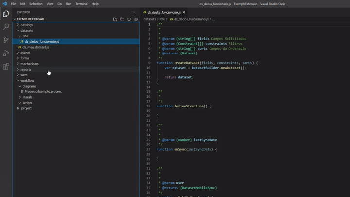
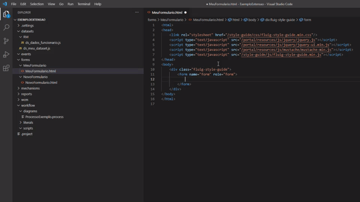
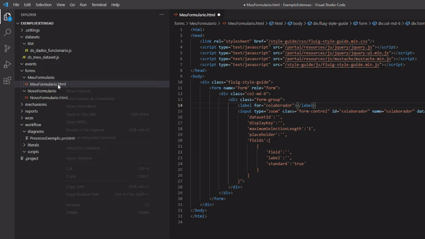
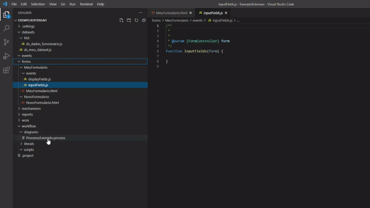

# fluig-vscode-extension

Extensão para facilitar o desenvolvimento na plataforma TOTVS Fluig utilizando o VS Code.

Os comandos aparecem ao clicar com o botão direito do mouse nos arquivos e diretórios.

## Recomendações

Instalar a [Declaração de Tipos](https://github.com/brunogasparetto/fluig-declaration-type) do Fluig para ter auto-complete no VS Code.

## Funcionalidades

Por enquanto é possível executar as seguintes ações:

- Novo Dataset;
- Novo Formulário;
- Novo Evento de Formulário (selecionando um formulário);
- Novo Evento de Processo (selecionando um diagrama);
- Snippets para HTML;
- Snippets para JavaScript (diferenciando na descrição se é para o front ou para o back);

### Criando um Dataset.

### Criando um Formulário.

### Snippets para HTML e JavaScript

### Criando Evento de Formulário

Deve-se selecionar um formulário para ter essa opção.

### Criando Evento de Processo

Deve-se selecionar um diagrama (arquivo com extensão .process) para ter essa opção.

## Todo

- Criar Widgets;
- Criar Layouts;
- Criar todos os templates de Eventos Globais;
- Adicionar novos Snippets;
