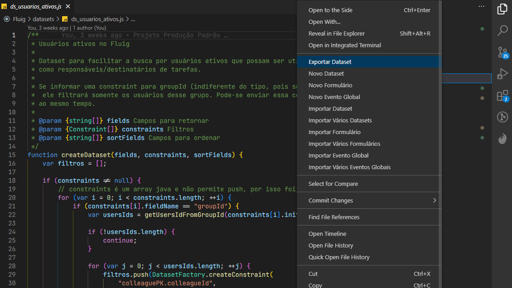
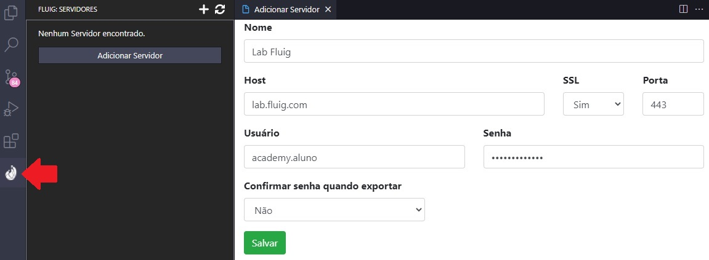
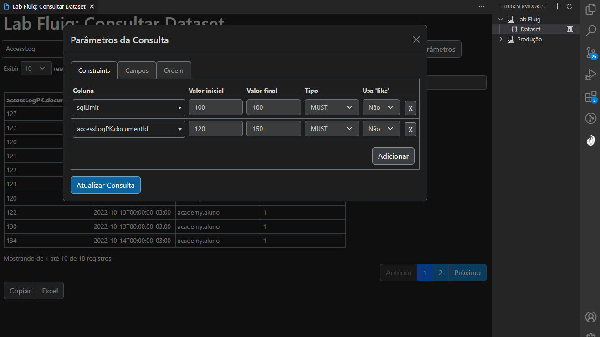

# Fluig - Extensão para Desenvolvimento no VSCode

   

Extensão para facilitar o desenvolvimento na plataforma TOTVS Fluig utilizando o VSCode.

Essa extensão adiciona alguns comandos para criar arquivos e snippets HTML e JavaScript, além de
gerenciar seus Servidores Fluig e permitir Importar e Exportar Datasets.

Os comandos aparecem ao clicar com o botão direito do mouse nos arquivos e diretórios ou
pressionando F1 (Command Palette), sendo obrigatório ter um Diretório / Workspace aberto.

## Aviso

Essa extensão não é mantida pela TOTVS e não possuí suporte da TOTVS. Sendo uma extensão feita pela comunidade de desenvolvedores para Fluig. O ambiente oficial para desenvolvimento no Fluig continua sendo o Eclipse Luna, conforme documentação oficial do Fluig.

## Instalação

Você pode procurar pela extensão `Fluig - Extensão para Desenvolvimento` no VSCode, baixá-la diretamente no [VS
Code Market Place: Fluig - Extensão para Desenvolvimento](https://marketplace.visualstudio.com/items?itemName=Fluiggers.fluiggers-fluig-vscode-extension) ou abrir o **Quick Open** (CTRL + P) e executar o
comando `ext install fluiggers.fluiggers-fluig-vscode-extension`.

## Importante!

Essa extensão cria os arquivos utilizando os tipos declarados na biblioteca [Declaração de Tipos
para o Fluig](https://github.com/fluiggers/fluig-declaration-type) para ter auto-complete no
VS Code, por isso é recomendado que ela seja instalada.

Você pode instalar a **Declaração de Tipos para o Fluig** baixando o último release disponibilizado no GitHub ou
pode executar o comando `Fluig: Instalar Declarações de Tipo`, no **Command Palette** (normalmente com a tecla de atalho F1),
para que a Extensão baixe os arquivos para o seu workspace / diretório.

### Erro de Linguagem não reconhecida

Essa extensão adiciona snippets para a linguagem FreeMarker (extensão ftl),
utilizada nos widgets e templates de e-mail.

Se você não tem uma extensão para tratar a linguagem FreeMarker pode receber
um aviso de erro de linguagem não reconhecida.

## Como utilizar

Para utilizar os comandos de criação de arquivos é obrigatório estar com um diretório / workspace
aberto.

- [Gerenciar Servidores](#gerenciar-servidores);
- [Consultar Dataset](#consultar-dataset);
- [Novo Dataset](#novo-dataset);
- [Novo Formulário](#novo-formulário);
- [Novo Evento Global](#novo-evento-global);
- [Novo Evento de Formulário](#novo-evento-de-formulário);
- [Novo Evento de Processo](#novo-evento-de-processo);
- [Novo Mecanismo Customizado](#novo-mecanismo-customizado);
- [Importar Dataset e Importar Vários Datasets](#importar-dataset);
- [Exportar Dataset](#exportar-dataset);
- [Importar Formulário e Importar Vários Formulários](#importar-formulário);
- [Exportar Formulário](#exportar-formulário);
- [Importar Evento Global e Importar Vários Eventos Globais](#importar-evento-global);
- [Snippets para HTML](#snippets-para-html);
- [Snippets para JavaScript](#snippets-para-javascript);

## Gerenciar Servidores

Com a extensão instalada será adicionada a visão de gerenciamento de servidores. Nela é possível
adicionar, editar e remover servidores Fluig.

A senha é criptografada utilizando identificadores do computador como chave da criptografia, assim não é possível
decifrar a senha em outro computador, prevenindo a perda de credenciais.

Ao clicar em um servidor é possível visualizar alguns comandos disponíveis. Com eles podemos consultar dataset, serviços etc.

### Consultar Dataset

Ao clicar no servidor será disponibilizada a opção Dataset. Nela você pode consultar um dataset do servidor.

A consulta de Dataset permite configurar as Constraints, selecionar os campos a serem exibidos e também a ordenação.

Diferente do plugin do Eclipse a Consulta de Dataset permite informar uma Constraint que não seja um campo do Dataset,
sendo útil para consulta de Pai Filho ou de Datasets que aceitam Constraints que não são campos retornados.

Diferente do Plugin do Eclipse é possível efetuar várias consultas aos Datasets, cada consulta em sua aba.

## Novo Dataset

Esse comando cria um arquivo JavaScript, após você preencher o nome do Dataset, no diretório
`datasets` do seu projeto Fluig.

O arquivo vem com as quatro funções básicas de datasets que o Fluig disponibiliza.

Você pode executar esse comando no **Command Palette**, no menu de contexto no **File Explorer** ou pelo
atalho **CTRL + F10** (CMD + F10 no Mac).

## Novo Formulário

Esse comando cria, após preencher o nome, um diretório contendo um arquivo HTML de formulário.
Esse diretório é criado dentro do diretório `forms` do seu projeto Fluig.

O arquivo HTML vem com o esqueleto básico de um formulário Fluig utilizando o **Fluig Style Guide**.

Você pode executar esse comando no **Command Palette**, no menu de contexto no **File Explorer** ou pelo
atalho **CTRL + F11** (CMD + F11 no Mac).

## Novo Evento Global

Esse comando cria um arquivo JavaScript, após selecionar o evento, no diretório `events` do seu
projeto Fluig.

O arquivo JavaScript contém a estrutura da função do evento selecionado.

Você pode executar esse comando no **Command Palette** ou com o menu de contexto no **File Explorer**.

Eventos disponibilizados:

- afterActivateUser
- afterDeactivateUser
- afterLogin
- beforeActivateUser
- beforeDeactivateUser
- beforeLogin
- displayCentralTasks
- onLoginError
- onLogout
- onNotify

## Novo Evento de Formulário

Esse comando cria um arquivo JavaScript, após selecionar o evento, no diretório `events` do
formulário selecionado.

Esse comando é exibido no menu de contexto no **File Explorer** ao selecionar um **Formulário**
ou qualquer arquivo / diretório que esteja dentro de um formulário. També é possível utilizar com o
atalho **CTRL + F12** (CMD + F12 no Mac) enquanto estiver editando algum arquivo do formulário.

O arquivo JavaScript contém a estrutura da função do evento selecionado.

Eventos disponibilizados:

- afterProcessing
- afterSaveNew
- beforeProcessing
- displayFields
- enableFields
- inputFields
- setEnable
- validateForm

## Novo Evento de Processo

Esse comando cria um arquivo JavaScript, após selecionar o evento, no diretório `workflow/scripts`
do seu projeto Fluig.

Esse comando é exibido no menu de contexto no **File Explorer** ao selecionar um **Diagrama**,
que são arquivos com a extensão **.process** e estão no diretório `workflow/diagrams`, ou ao selecionar um evento de
processo, que são arquivos .js que estão em `workflow/scripts`. Também é possível acionar o comando com o atalho
**CTRL + F12** (CMD + F12 no Mac) enquanto estiver editando um evento de processo.

O arquivo JavaScript será nomeado seguindo a regra do Fluig (nome_do_diagrama.nome_do_evento.js) e
contém a estrutura da função do evento selecionado.

É possível criar uma função compartilhada para o processo selecionando a opção **Nova Função** no
menu de eventos. Quando o fizer será solicitado que informe o nome da função.

Eventos disponibilizados:

- afterCancelProcess
- afterProcessCreate
- afterProcessFinish
- afterReleaseProcessVersion
- afterReleaseVersion
- afterStateEntry
- afterStateLeave
- afterTaskComplete
- afterTaskCreate
- afterTaskSave
- beforeCancelProcess
- beforeSendData
- beforeStateEntry
- beforeStateLeave
- beforeTaskComplete
- beforeTaskCreate
- beforeTaskSave
- calculateAgreement
- checkComplementsPermission
- subProcessCreated
- validateAvailableStates

## Novo Mecanismo Customizado

Esse comando cria um arquivo JavaScript, após você preencher o nome do Mecanismo, no diretório
`mechanisms` do seu projeto Fluig.

O arquivo vem com a função padrão que retorna os usuários que podem ser selecionados pelo
mecanismo de atribuição.

Você pode executar esse comando no **Command Palette** e no menu de contexto no **File Explorer**.

## Importar Dataset

Para importar Dataset (ou vários) é necessário clicar com o botão direito do mouse em qualquer
lugar do **File Explorer** ou usar o **Command Pallete** (pressionando F1) e então selecionar um
dos comandos de importação (`Fluig: Importar Dataset` ou `Fluig: Importar Vários Datasets`).

Após selecionar o servidor é exibido a lista de Datasets do servidor para selecionar qual/quais
serão importados.

## Exportar Dataset

Para exportar Dataset clique com o botão direito do mouse sobre o Dataset e selecione `Exportar Dataset` ou,
enquanto editando o dataset, utilize o atalho **CTRL + F9** (CMD + F9 no Mac).

Após selecionar o servidor você poderá escolher um dos datasets listados para efetuar uma edição ou
selecionar a opção **Novo Dataset** para criar o Dataset no servidor.

## Importar Formulário

Para importar Formulário é necessário clicar com o botão direito do mouse em qualquer lugar do
**File Explorer** ou usar o **Command Pallete** (pressionando F1) e então selecionar o comando de
importação (`Fluig: Importar Formulário` ou `Fluig: Importar Vários Formulários`).

Após selecionar o servidor é exibido a lista de Formulários do servidor para selecionar qual/quais serão
importados.

## Exportar Formulário

Para exportar um formulário clique com o botão direito do mouse sobre o Formulário e selecione a opção `Exportar Formulário`
ou, enquanto edita qualquer arquivo do formulário, utilize o atalho **CTRL + F9** (CMD + F9 no Mac).

Após selecionar o servidor você poderá escolher um dos formulários listados para efetuar uma edição ou selecionar a opção
**Novo Formulário** para criar um formulário no servidor.

Ao criar um formulário você deve indicar o ID da pasta onde ele será salvo (não há opção de pesquisar pastas igual ao Eclipse),
indicar um nome de Dataset para o formulário e o modo de persistência (em uma tabela própria ou numa única tabela).

Ao editar um formulário você pode indicar se deve ou não atualizar a versão.

É obrigatório que o nome do arquivo HTML seja igual ao nome da pasta do diretório que está no seu computador (o nome do formulário no servidor
é indiferente), pois é isso que determina qual é o arquivo principal do formulário.

## Importar Evento Global

Para importar Evento Global é necessário clicar com o botão direito do mouse em qualquer lugar do
**File Explorer** ou usar o **Command Pallete** (pressionando F1) e então selecionar o comando de
importação (`Fluig: Importar Evento Global` ou `Fluig: Importar Vários Eventos Globais`).

Após selecionar o servidor é exibido a lista de Eventos Globais do servidor para selecionar qual/quais serão
importados.

## Snippets para HTML

Snippets para criar estruturas HTML seguindo o **Fluig Style Guide**.

Os snippets disponibilizados são:

- **fluig-alert**: Cria um alerta;
- **fluig-alert-dismissible**: Cria um alerta que pode ser fechado;
- **fluig-button-dropdown-split**: Cria um botão com sub menu;
- **fluig-checkbox**: Cria um input customizado do tipo checkbox;
- **fluig-checkbox-inline**: Cria um input customizado inline do tipo checkbox;
- **fluig-input-data**: cria uma coluna com input do tipo texto e ícone de calendário;
- **fluig-input-text**: cria uma coluna contendo um input do tipo texto;
- **fluig-input-textarea**: cria uma coluna contendo um textarea;
- **fluig-input-zoom**: cria uma coluna contendo um Zoom;
- **fluig-panel**: cria um painel;
- **fluig-panel-collapse**: cria um painel com estrutura de collapse;
- **fluig-radio**: Cria um input customizado do tipo radio;
- **fluig-radio-inline**: Cria um input customizado inline do tipo radio;
- **fluig-switch-aprovacao**: cria uma linha contendo dois botões para indicar aprovação / reprovação;
- **fluig-tabs**: Cria uma navegação em Abas;

## Snippets para JavaScript

Devido ao Fluig utilizar JavaScript para front-end (navegador) e JavaScript para back-end que será
convertido em Java (e possui um suporte antigo) na descrição de cada snippet é indicado se ele deve
ser utilizado em qual dos dois ambientes.

### Snippets para Back-End

- **fluig-consulta-jdbc**: cria uma consulta direta ao Banco de Dados usando JDBC;
- **fluig-function-data**: cria uma função que retorna a data atual formatada no padrão solicitado;
- **fluig-paifilho-loop**: cria um loop for percorrendo os elementos de uma tabela pai filho em evento de Formulário;
- **fluig-paifilho-loop-workflow**: cria um loop for percorrendo os elementos de uma tabela pai filho em evento de Processo;

### Snippets para Front-End

- **fluig-beforeMovementOptions**: Evento beforeMovementOptions do formulário no Processo;
- **fluig-beforeSendValidate**: Evento beforeSendValidate do formulário no Processo;
- **fluig-calendar**: Ativa o plugin de Data em um input text;
- **fluig-data-atual**: Pega a data atual formatada em PT-BR;
- **fluig-zoom-removed**: Função executada ao desmarcar item no Zoom;
- **fluig-zoom-selected**: Função executada ao selecionar item no Zoom;
- **fluig-dataset-async**: Chamar Dataset de modo Assíncrono
- **fluig-modal**: Criar modal do Fluig
- **fluig-widget**: Criar o esqueleto de uma Widget

## Todo

- Criar comando Novo Widget;
- Criar comando Novo Layout;
- Adicionar todos os templates de Eventos Globais;
- Adicionar Snippets;

## Colaboração

Sinta-se à vontade para colaborar criando mais snippets, templates de arquivos e comandos.

Basta criar um fork e efetuar uma PR quando estiver pronto.
